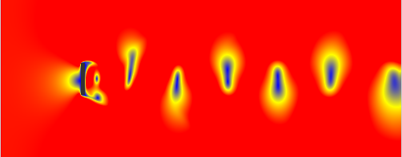
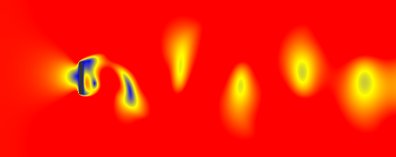

# LBM-SMC — Lattice Boltzmann Simulation with Particle Filter Localization

> GPU-accelerated 2D fluid dynamics simulation using the Lattice Boltzmann Method (D2Q9),
> coupled with a Sequential Monte Carlo filter (SIR) for real-time obstacle localization.


---

## Overview

This project simulates 2D fluid flow around an obstacle in a channel,
solving the Lattice Boltzmann equation (D2Q9) entirely on GPU via CUDA.
A Sequential Monte Carlo filter (SIR) estimates the obstacle position in real-time
from local velocity measurements and an analytical dipole model.

**Key results:**
- 180 MLUPS on RTX 4070 SUPER (500×200 grid)
    | Throughput (LBM only, peak)     | 274 MLUPS |
    | Throughput (LBM + SMC, steady)  | 180 MLUPS |
- Stable Von Kármán vortex street at Re = 100
- Obstacle localization error < 10 px with 1 000 000 particles

| Re = 100 — Stable Von Kármán street | Re = 200 — Turbulent transition |
|---|---|
 | 

---

## Lattice Boltzmann Method (D2Q9)

The Lattice Boltzmann Method (LBM) is a mesoscopic approach to computational fluid dynamics.
Rather than solving the Navier-Stokes equations directly, it models the fluid as a set of
particle distribution functions evolving on a discrete lattice.

### D2Q9 Lattice

Each cell holds 9 distribution functions `f_k` corresponding to 9 discrete velocity directions:

```
6  2  5
3  0  1
7  4  8
```

Each direction `k` has an associated velocity `(cx_k, cy_k)` and weight `w_k`:
- Rest:      `w = 4/9`
- Cardinal:  `w = 1/9`
- Diagonal:  `w = 1/36`

These weights are derived from the discretization of the Maxwell-Boltzmann distribution.

### Algorithm per timestep

**1. Pull Streaming**

Each cell pulls its distributions from its neighbors:

```
f_next[k](x, y) = f[k](x - cx_k, y - cy_k)
```

**2. BGK Collision**

The distribution is relaxed toward a local equilibrium `f_eq`:

```
f[k] += ω * (f_eq[k] - f[k])
```

where `ω = 1 / (3ν + 0.5)` is the relaxation parameter and `ν` the kinematic viscosity.

The equilibrium distribution is:

```
f_eq[k] = w_k * ρ * (1 + 3(u·c_k) + 4.5(u·c_k)² - 1.5|u|²)
```

### Boundary Conditions

- **Inlet** (left wall): equilibrium distribution re-injected at each timestep with velocity `u0`
- **Outlet** (right wall): zero-gradient — distributions copied from the previous column
- **Obstacle**: bounce-back — incoming distributions reflected in the opposite direction
- **Top/Bottom**: periodic boundary conditions in Y

---

## CUDA Parallelization

The LBM is inherently parallel — each cell is independent during streaming and collision.
The entire grid is mapped to a 2D CUDA thread grid where **each thread handles one cell (x, y)**.

### Thread Layout

```cpp
dim3 threadsPerBlock(16, 16);
dim3 numBlocks((width + 15) / 16, (height + 15) / 16);
```

### Kernels

| Kernel | Role |
|---|---|
| `init_kernel` | Initializes `f`, `f_next` and `bar` with equilibrium distributions |
| `pullStreaming_kernel` | Streams distributions from neighbors, handles all boundary conditions |
| `collision_kernel` | Computes ρ, ux, uy and applies BGK relaxation in-place |
| `sample_velocity_kernel` | Reads LBM velocity field at sensor positions directly on GPU |
| `prediction_kernel` | Adds Gaussian noise to each particle (cuRAND) |
| `weightUpdate` | Computes dipole prediction and likelihood for each particle |

### Pull vs Push Streaming

The standard CPU implementation uses **push streaming** — each cell sends its distributions
to its neighbors. On GPU, this creates **race conditions**: multiple threads writing to the
same cell simultaneously produce non-deterministic results and numerical instability.

**Pull streaming** solves this — each thread reads from its neighbors instead of writing,
guaranteeing that each memory location is written by exactly one thread. This is the
standard approach for LBM on GPU.

### Double Buffering

Two buffers `d_f_` and `d_f_next_` are allocated on device.
After each streaming step, the pointers are swapped on the CPU side:

```cpp
std::swap(d_f_, d_f_next_);
```

No data is copied — only two pointers are exchanged, making this operation free.

---

## OpenGL Renderer

Each frame, the simulation state is rendered as a heatmap texture mapping
fluid speed to a Blue → Green → Red gradient (Hunter Adams colormap).

### Pipeline

```
collision_kernel  →  d_speed_ (GPU)
        ↓
cudaMemcpy DeviceToHost  →  speed_host_ (CPU)
        ↓
CPU colormap loop  →  RGBA pixel buffer
        ↓
glTexImage2D  →  OpenGL texture  →  fullscreen quad
```

### Colormap

```cpp
float t = clamp(speed / u0, 0.0f, 1.0f);
r = min(2*t,       1.0f);
g = min(2*t, 2.0f - 2*t);
b = max(1.0f - 2*t, 0.0f);
```

### CUDA/OpenGL Interop — PBO

The renderer was designed to use a **Pixel Buffer Object (PBO)**, allowing CUDA to write
pixel data directly into an OpenGL buffer on GPU, eliminating all CPU transfers:

```
CUDA kernel → PBO (GPU) → glTexSubImage2D → screen
```

However, `cudaGraphicsGLRegisterBuffer` returns `OS_CALL_FAILED` under **WSL2**,
as CUDA/OpenGL interop requires a native OpenGL context unavailable in that environment.
The current implementation uses a targeted `cudaMemcpy` DeviceToHost instead,
copying only `d_speed_` and `d_bar_` — the two arrays needed for rendering.

On a native Linux or Windows setup, the full PBO pipeline is implemented
and eliminates this transfer entirely.

---

## Sequential Monte Carlo — SIR Filter

The SMC module estimates the 2D position of the obstacle in real-time
using velocity measurements from 5 fixed sensors placed downstream.

### State and Measurements

- **State** `X = (x, y)` — obstacle position in lattice coordinates
- **Measurement** `Z` — velocity vector `(ux, uy)` at each of 5 sensors → 10-dimensional

### Prediction Model

Each particle evolves with a Gaussian random walk, generated on GPU via **cuRAND**:

```
X_{t+1} = X_t + N(0, σ_process²)
```

### Measurement Model

The expected velocity at sensor `j` given obstacle position `X` is computed
using the **analytical dipole** (potential flow around a cylinder):

```
ux = u0 * (1 - R²·(dx² - dy²) / r⁴)
uy = u0 * (   - R²·(2·dx·dy)  / r⁴)
```

This model is O(1) per sensor — chosen over surrogate/ML models for computational efficiency.
Its main limitation is that it does not account for fluid viscosity: at high Reynolds numbers,
the real velocity field diverges significantly from the potential flow assumption,
which degrades filter accuracy. This is an identified limitation, not a bug.

### Weight Update

```
w_i ∝ exp( -||z_pred_i - z_meas||² / (2·σ_meas²) )
```

### Resampling

Systematic resampling (Arulampalam et al., 2002) is triggered when ESS < N/2:

```
ESS = 1 / Σ w_i²
```

### GPU Parallelization

| Operation | Implementation |
|---|---|
| Prediction | GPU — `prediction_kernel` + cuRAND |
| Dipole prediction | GPU — `weightUpdate` kernel |
| Weight likelihood | GPU — `weightUpdate` kernel |
| Normalization | CPU |
| ESS | CPU  |
| Resampling | CPU — systematic resampling |
| Estimation | CPU — weighted mean |

Thrust note: A GPU‑based resampling using Thrust was implemented but caused segmentation faults due to CUDA 
context conflicts under WSL2 (mixed OpenGL/CUDA contexts). The CPU fallback is stable and fast
enough for up to 10⁶ particles. Future work will revisit Thrust on a native Linux setup.
---

## Performance

Tested on **NVIDIA GeForce RTX 4070 SUPER** (sm_89), grid 500×200:

| Metric | Value |
|---|---|
| Throughput | **180 MLUPS** |
| Particles | 1 000 000 |
| Localization error | < 10 px |
| Strouhal number | ~0.23 |

---

## Build

### Dependencies

- CUDA Toolkit ≥ 12.0
- OpenGL + GLFW + GLEW
- libcurand

### With CMake

```bash
git clone https://github.com/robennicolas/LBM-SMC.git
cd LBM-SMC
mkdir build && cd build
cmake .. 
make -j
```

### With nvcc directly

```bash
nvcc src/lbm_gpu.cu src/render_gpu.cu src/smc_gpu.cu src/main.cu \
    -I./include \
    -lglfw -lGL -lGLEW -lcurand \
    -arch=sm_89 -std=c++17 \
    -o lbm_sim
./lbm_sim
```

---

## Project Structure

```
LBM-SMC/
├── include/
│   ├── lbm/
│   │   └── lbm_gpu.h
│   ├── filter/
│   │   └── smc_gpu.h
│
├── src/
│   ├── lbm/
│   │   └── lbm_gpu.cu
│   └── filter/
│       └── smc_gpu.cu
├── app/
│   └── main.cu
│
renderer/
│   ├── render_gpu.h
│   └── render_gpu.cu
│
├── utils/
│   ├── metrics.h
│   └── metrics.cu
│
├── CMakeLists.txt
├── LICENSE
└── README.md
```

---

## Future Work

- GPU resampling via Thrust prefix scan (`inclusive_scan`)
- Re-enable PBO zero-copy rendering on native Linux/Windows
- Viscosity-aware measurement model (beyond potential flow)
- Multi-obstacle support (extended state vector)

---

## References

- Arulampalam et al., *A Tutorial on Particle Filters* (2002)
- Hunter Adams, *Lattice Boltzmann D2Q9* — colormap and scheme
- NVIDIA CUDA Toolkit Documentation

---

## License

MIT License — see `LICENSE` file.
